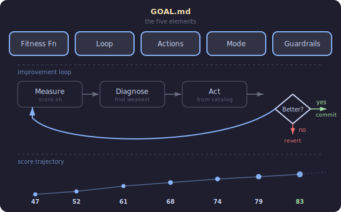
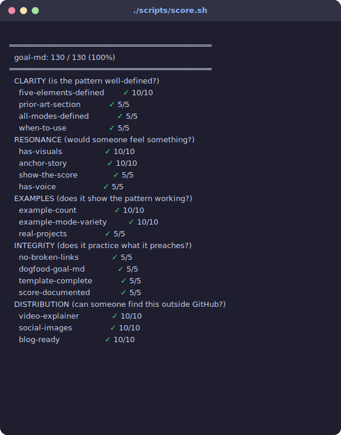

# GOAL.md

**A goal-specification file for autonomous coding agents.**



Karpathy's [autoresearch](https://github.com/karpathy/autoresearch) showed that an agent + a fitness function + a loop = overnight research. But it only works when the metric is obvious — loss goes down. What about everything else?

## The story

I had a Playwright test suite for a routing system. 30 routes, half broken, no way to know which ones actually worked. I wanted an AI agent to fix it — not as a one-shot task, but as an ongoing loop. Run the tests, see what's broken, fix it, run again.

The problem: there's no `val_bpb` for "is this test infrastructure trustworthy?" I had to build the ruler before I could measure. So I wrote a scoring script:

```
═══════════════════════════════════════════
  routing confidence: 47 / 100 (47%)
═══════════════════════════════════════════

    health                       ✗ 0.42
    accuracy                     ◐ 0.61
    coverage                     ◐ 0.67
    consistency                  ✗ 0.38
```

Then I wrote a file that told the agent: here's the score, here's how to make it go up, here's when to stop. I left it running. It went from 47 to 83 over a few hours. 12 commits, each one atomic, each one making the score go up.

That file became GOAL.md.

## Why not just a good CLAUDE.md?

CLAUDE.md tells an agent *how to work* in your repo. Build commands, conventions, architecture. It's a manual.

GOAL.md tells an agent *what "better" means* and how to get there. It's a reward function with an improvement loop attached. The agent doesn't need you to tell it what to do next — it measures, diagnoses, acts, and verifies on its own.

You need a GOAL.md when:
- The work is an **optimization loop**, not a one-shot task
- "Better" requires a **constructed metric**, not just "tests pass"
- You want the agent to work **across multiple sessions** without re-explaining the goal
- You want to go to sleep and wake up to progress

## The five elements

### 1. Fitness function

A computable definition of "better." Not a vibe — a number.

```bash
./scripts/score.sh    # → 47/100... then 52... then 61... then 83
```

autoresearch has `evaluate_bpb()` in a read-only Python file. Beautiful, but only works when God gives you a scalar metric. Most software doesn't have that. You have to construct one.

**The key question: can the agent modify its own metric?**

| Mode | What it means |
|------|---------------|
| **Locked** | Agent can't touch the scoring code. autoresearch does this. |
| **Split** | Agent can improve the *measurement instrument* but not the *definition of good*. This is the interesting one. |
| **Open** | Agent can modify everything, including how success is measured. Early-stage projects. |

The **split mode** is where it gets interesting. I had two scores: one for "is the routing actually working?" (the thing) and one for "can we trust what the tests are telling us?" (the instrument). The agent could make the instrument better — add tests, fix detection patterns — without gaming the outcome score. You need a dual-score system when the agent is building its own telescope.

### 2. Improvement loop

A closed cycle. Measure → diagnose → act → verify → keep or revert.

```
repeat:
  1. Run the fitness function
  2. Find the weakest component
  3. Pick the highest-impact action
  4. Make the change
  5. Re-measure
  6. Improved? Commit. Regressed? Revert.
```

autoresearch: modify `train.py` → run → check `val_bpb` → keep or `git reset`. Same structure, different domain.

### 3. Action catalog

Concrete moves the agent can make, with estimated impact.

```
| Action                          | Impact    | How                              |
|---------------------------------|-----------|----------------------------------|
| Fix and re-run a broken test    | +5 pts    | Diagnose failure, fix, re-run    |
| Add missing config page         | +3-5 pts  | Create from template             |
| Fix a bidirectional link        | +2-3 pts  | Add the missing side             |
```

autoresearch leaves this implicit: "everything in `train.py` is fair game." That works for neural nets. For software, being explicit helps — it tells the agent "this is a 5-point move, that's a 1-point move" so it doesn't waste time on low-impact changes.

The point estimates don't need to be precise. They're prioritization signals.

### 4. Operating mode

How autonomous is the agent?

| Mode | When to use |
|------|-------------|
| **Converge** | Stop when criteria met. "Get every score above 80, then report." |
| **Continuous** | Run forever. autoresearch: "NEVER STOP... the human might be asleep." |
| **Supervised** | Pause at gates. For high-stakes changes or early iterations while building trust. |

Think of these like Claude Code's permission modes. Same agent, different leash length.

### 5. Constraints

What the agent must not do. Load-bearing guardrails, not suggestions.

```
- Never fabricate test results — they come from the test runner only
- Never modify credentials
- Always measure before and after — score must not decrease
- Atomic commits — one improvement each, so reverts are clean
```

autoresearch: "don't modify `prepare.py`", "don't add dependencies", "simpler is better."

## The lineage

```
autoresearch (Karpathy, Mar 2026)
  program.md + prepare.py + train.py
  Single scalar metric, immutable eval, infinite loop
  Domain: LLM training
      │
      ├── autoresearch-anything (zkarimi22)
      │     "what metric? how to extract?" — first attempt at generalizing
      │
      └── GOAL.md (this)
            Constructed metrics, dual scores, action catalog, operating modes
            Domain: any software project with an optimization goal
```

## Prior art

| Concept | What it contributes | What it lacks |
|---------|-------------------|---------------|
| **autoresearch** (Karpathy, 2026) | Immutable fitness function, keep/discard gate, "never stop" loop | Domain-specific, no action catalog, single scalar only |
| **Eval-Driven Development** ([evaldriven.org](https://evaldriven.org/)) | Correctness specs with measurable thresholds | No agent-facing file format, no improvement loop |
| **AGENTS.md** (Google, OpenAI, 20k+ repos) | Conventions and build commands for AI agents | Purely descriptive — no goals, no scores, no loop |
| **Ralph Wiggum** (Huntley, Claude Code plugin) | Persistent bash loop, circuit breaker | No numeric fitness function, no action catalog |
| **GOAP** (game AI, 2003) | Action inventory with preconditions and effects | Not LLM-oriented |

## This repo dogfoods itself

This repo has its own [`GOAL.md`](GOAL.md) and scoring script:



A future Claude session can pick up the GOAL.md in this repo and work autonomously to improve the score. Turtles all the way down.

## When you need a GOAL.md

You probably need one when:
- The work is an **optimization loop**, not a one-shot task
- "Better" requires a **constructed metric**, not just "tests pass"
- You want the agent to be **autonomous** across multiple sessions
- You want to go to sleep and wake up to progress

You probably don't need one when:
- It's a single well-defined change ("add a dark mode toggle")
- "Done" is obvious (tests pass, types check, PR approved)
- A CLAUDE.md with good instructions is enough

## Get started

1. Copy [`template/GOAL.md`](template/GOAL.md) into your repo
2. Define your fitness function (a script that outputs a number)
3. Fill in the improvement loop and action catalog
4. Point an agent at it and let it run

## Real examples

| Project | Domain | Metric | Mode | Link |
|---------|--------|--------|------|------|
| browser-grid | Playwright plugin | 10-criterion checklist | Converge | [`examples/browser-grid.md`](examples/browser-grid.md) |

More examples welcome — open a PR.

## License

MIT
