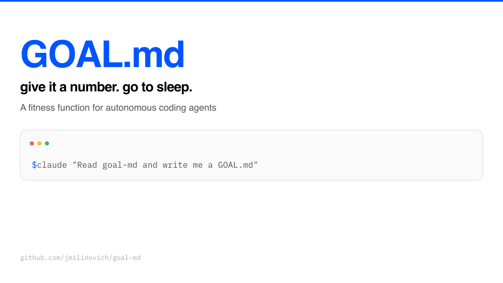
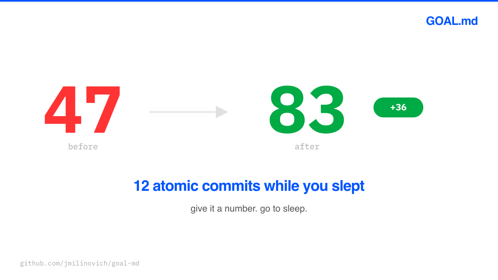
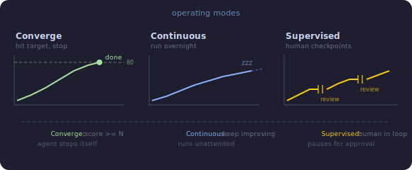
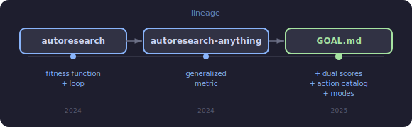
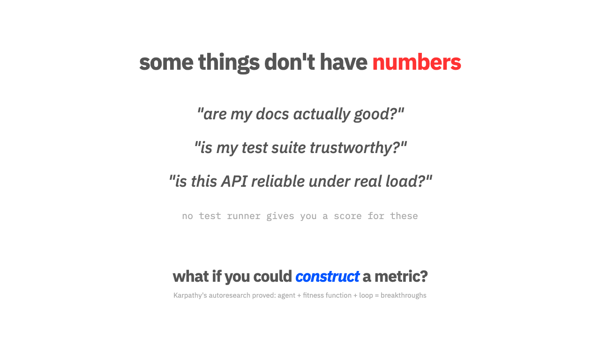
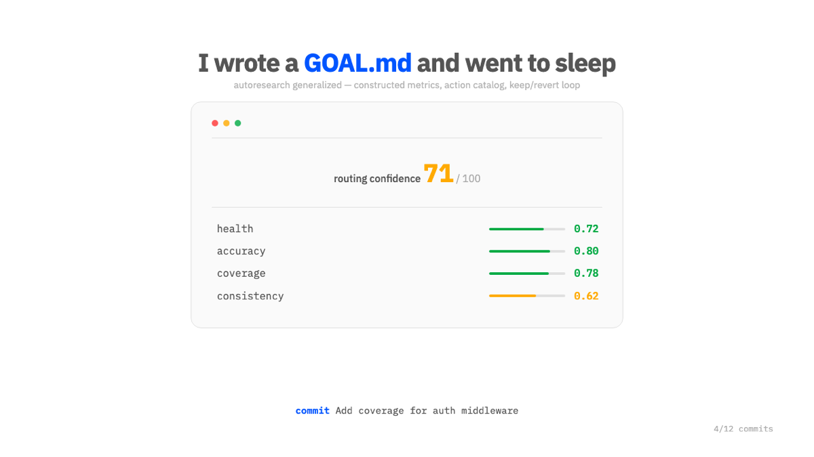
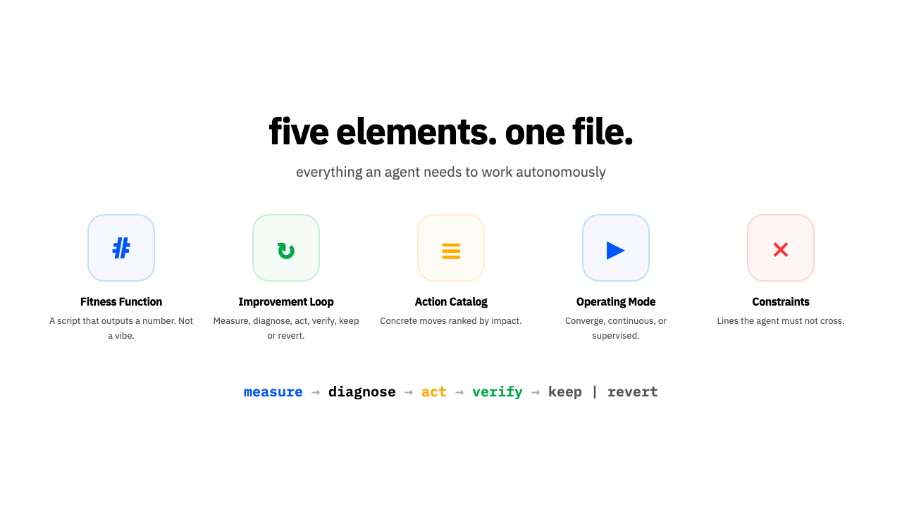
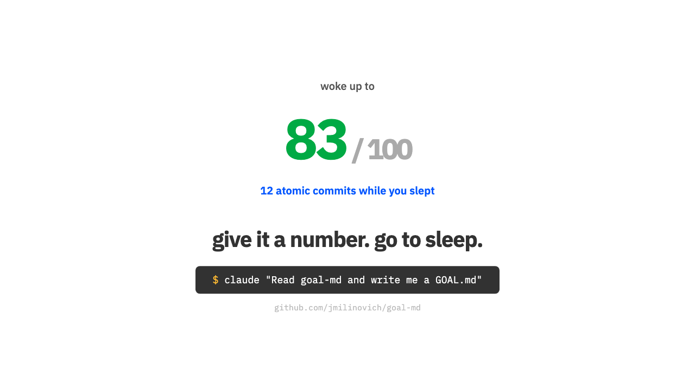

# GOAL.md



### give it a number. go to sleep.

Give an AI agent a number to make go up and a loop to do it in. Then go to sleep.

[](video/out/video.mp4)

> [Watch the 2-minute explainer video](video/out/video.mp4)


Karpathy's [autoresearch](https://github.com/karpathy/autoresearch) proved the formula: agent + fitness function + loop = overnight breakthroughs. But autoresearch only works when you already have a scalar metric. Loss goes down, paper gets better. Most software isn't like that. You have to *construct* the metric before you can optimize it.

GOAL.md is the pattern for doing that. One file you drop into a repo that turns a coding agent into an autonomous improver. This repo itself is designed to be consumed by agents — the template is a prompt, the examples are few-shot training data, and the CLAUDE.md teaches an agent how to write a good GOAL.md for *your* project.

## How I stumbled into this

I had 30 Playwright tests for a routing system. Half were broken, no way to tell which. I wanted Claude to fix them, but the real problem wasn't "fix the tests." It was: how do you even measure whether test infrastructure is trustworthy? There's no coverage tool for that. No test runner. Nothing. I had to build the ruler before I could measure.

```
═══════════════════════════════════════════
  routing confidence: 47 / 100 (47%)
═══════════════════════════════════════════

    health                       ✗ 0.42
    accuracy                     ◐ 0.61
    coverage                     ◐ 0.67
    consistency                  ✗ 0.38
```

So I constructed a metric: four weighted components that together define "routing confidence." Then I wrote a file that told Claude: here's the score, here's how to make it go up, here's when to stop. Went to bed. Woke up to 12 commits, each atomic, each pushing the score higher. 47 → 83.

That file became GOAL.md. The wild part wasn't the loop — any agent can loop. It was that I had to *construct the ruler* before the agent could measure anything. Once it had a number, it knew exactly what to do.

## The real test

The Playwright story convinced me this works. But tests are at least somewhat measurable — they pass or fail. The real question was: does this generalize to things that seem genuinely immeasurable?

Documentation quality. "Are my docs actually good?" There's no test runner for that. No coverage tool. No `pytest --cov` equivalent. Just vibes. The [`docs-quality`](examples/docs-quality.md) GOAL.md had to construct the entire measurement apparatus from scratch: a prop-accuracy checker, an example compiler, a calibrated linter. Three tools that didn't exist, producing a score that didn't exist, for a quality dimension that most teams just eyeball.

But here's the part that surprised me. The agent needed a *dual scoring system* — one score for documentation quality, another for instrument quality. Because the linter itself was broken. Vale was flagging `onChange` as a spelling error. A naive agent would "fix" the docs to satisfy the linter, making them worse. So the GOAL.md scored the measuring tools separately: "how much can we trust the docs score?" The agent fixed its own telescope first, then used that telescope to fix the docs. It was building the ruler and measuring with it at the same time, and the dual-score pattern kept it from fooling itself.

That's when I knew this was a real pattern. If you can construct a fitness function for documentation quality — something with no natural metric at all — you can construct one for anything.

## Why not just a good CLAUDE.md?

CLAUDE.md is a manual. It tells an agent *how to work* in your repo. GOAL.md is a reward function. It tells an agent *what "better" means* and gives it a loop to get there. The agent measures, diagnoses, acts, and verifies on its own. You don't need to be in the room.

## The five elements

### 1. Fitness function

> Not a vibe. A number. The agent needs a computable definition of "better."

```bash
./scripts/score.sh    # → 47/100... then 52... then 61... then 83
```

autoresearch locks `evaluate_bpb()` in a read-only file. That's fine when you're optimizing loss. But most software metrics are made up by you, so who gets to change the ruler?

| Mode | What it means |
|------|---------------|
| **Locked** | Agent can't touch the scoring code. autoresearch does this. |
| **Split** | Agent can improve the *measurement instrument* but not the *definition of good*. |
| **Open** | Agent can modify everything, including how success is measured. |

Split mode is the one I actually use. I had two scores: "is the routing working?" (the thing) and "can we trust the tests?" (the instrument). The agent could sharpen the instrument (add tests, fix detection) without gaming the outcome. You need a dual-score setup when the agent is building its own telescope.

### 2. Improvement loop

> Measure → diagnose → act → verify → keep or revert. Every iteration leaves the repo better or unchanged, never worse.

```
repeat:
  1. Run the fitness function
  2. Find the weakest component
  3. Pick the highest-impact action
  4. Make the change
  5. Re-measure
  6. Improved? Commit. Regressed? Revert.
```

This is the same structure as autoresearch (`modify train.py → run → check val_bpb → keep or git reset`), just generalized beyond training runs.

Each iteration appends one line to `iterations.jsonl` — before/after scores, the action taken, and whether it was kept or reverted. Future sessions read this log to avoid repeating failed experiments and to build on what worked.

### 3. Action catalog

> A menu of concrete moves, ranked by impact. Tells the agent *where to spend its time.*

```
| Action                          | Impact    | How                              |
|---------------------------------|-----------|----------------------------------|
| Fix and re-run a broken test    | +5 pts    | Diagnose failure, fix, re-run    |
| Add missing config page         | +3-5 pts  | Create from template             |
| Fix a bidirectional link        | +2-3 pts  | Add the missing side             |
```

autoresearch leaves this implicit ("everything in `train.py` is fair game") which is fine for neural nets. For software, being explicit prevents the agent from burning cycles on 1-point changes when 5-point moves are sitting right there. The point estimates don't need to be precise. They're prioritization signals, not promises.

### 4. Operating mode

> How long is the leash? Same agent, different levels of autonomy.



| Mode | When to use |
|------|-------------|
| **Converge** | Stop when criteria met. "Get every score above 80, then report." |
| **Continuous** | Run forever. autoresearch: "NEVER STOP... the human might be asleep." |
| **Supervised** | Pause at gates. For high-stakes changes or early iterations while building trust. |

### 5. Constraints

> The lines the agent must not cross. These are load-bearing, not suggestions.

```
- Never fabricate test results — they come from the test runner only
- Never modify credentials
- Always measure before and after — score must not decrease
- Atomic commits — one improvement each, so reverts are clean
```

autoresearch has the same idea: "don't modify `prepare.py`", "don't add dependencies", "simpler is better." Without constraints the agent will absolutely find creative ways to make the number go up that you did not intend.

## The lineage



```
autoresearch (Karpathy, Mar 2026)
  program.md + prepare.py + train.py
  Single scalar metric, immutable eval, infinite loop
  Domain: LLM training
      │
      ├── autoresearch-anything (zkarimi22)
      │     "what metric? how to extract?" — first attempt at generalizing
      │
      └── GOAL.md (this)
            Constructed metrics, dual scores, action catalog, operating modes
            Domain: any software project with an optimization goal
```

See also: **Eval-Driven Development** ([evaldriven.org](https://evaldriven.org/)) — measurable correctness specs, but a methodology for humans, not a file format for agents. **AGENTS.md** (Google, OpenAI) — proved agents need repo-level context files, but descriptive ("how we work") not directive ("what to optimize"). **Ralph Wiggum** (Huntley) — persistent bash loop with a circuit breaker, but no numeric fitness function. **GOAP** (game AI, 2003) — action catalogs with preconditions and effects; LLM agents need less formalism but the idea is the same. **GEPA** (Khattab et al.) — multi-objective prompt evolution with fitness functions; the iteration log pattern here borrows from their approach of tracking what worked across generations.

## This repo dogfoods itself

This repo has its own [`GOAL.md`](GOAL.md) and scoring script:


A future Claude session can pick up the GOAL.md in this repo and keep improving the score. The scoring script is just bash and `jq` so it's not exactly robust, but it works.

## When you need a GOAL.md

You need one when the work is an optimization loop, not a one-shot task. When "better" requires a metric you have to construct, not just "tests pass." When you want to go to sleep and wake up to progress.

You don't need one for a single well-defined change ("add a dark mode toggle") or when "done" is obvious. If a CLAUDE.md with good instructions is enough, it's enough.

## Get started

The fastest way: point an agent at this repo and let it do the work.

```
Look at github.com/jmilinovich/goal-md — read the template and examples.
Then write me a GOAL.md for this repo and start working on it.
```

Or do it manually:

1. Copy [`template/GOAL.md`](template/GOAL.md) into your repo
2. Define your fitness function (a script that outputs a number)
3. Fill in the improvement loop and action catalog
4. Point an agent at it and let it run

## Real examples

These aren't just documentation — they're the few-shot examples an agent uses to pattern-match when writing a GOAL.md for your project. Each one demonstrates a different domain, metric style, and operating mode so the agent has enough variety to generalize.

| Project | Domain | Metric | Mode | Link |
|---------|--------|--------|------|------|
| browser-grid | Playwright plugin | 10-criterion checklist | Converge | [`examples/browser-grid.md`](examples/browser-grid.md) |
| api-test-coverage | REST API testing | Coverage score (pytest --cov) | Converge | [`examples/api-test-coverage.md`](examples/api-test-coverage.md) |
| perf-optimization | Web service perf | Latency/throughput composite (wrk + k6) | Continuous | [`examples/perf-optimization.md`](examples/perf-optimization.md) |
| docs-quality | React component lib docs | Dual: docs quality + instrument quality | Split/Converge | [`examples/docs-quality.md`](examples/docs-quality.md) |

More examples welcome. Open a PR — more variety here means better GOAL.md files for everyone's projects.

**Need help writing the fitness function?** See [`examples/scoring-scripts.md`](examples/scoring-scripts.md) for copy-paste scoring script recipes across common domains.

## Share


Tweet images for the [launch thread](docs/twitter-thread.md):

| The Problem | The Story | The Pattern | The CTA |
|:-----------:|:---------:|:-----------:|:-------:|
|  |  |  |  |

## License

MIT
